# AI 创业的第一性框架：赛道和时机

> 北大《AI创业与投资》第三课课堂笔记 · 2026 年 9 月 23 日（周三）晚 6:40 · 二教 109 室

**主讲人：刘勇**（TaoZ Capital 创始合伙人）
**课程定位：**《AI创业与投资》为北大 2 学分、本研合上课程，由嘉宾分享与学生组队做项目两部分组成。前两课为王小川（第一课：创新相对论与百川的思考）、朱啸虎（第二课：互联网和 AI 的创业与投资的异同）。

**讲者背景**（据课程预告）：刘勇是穿越互联网、移动互联网和 AI 三轮技术浪潮的连续成功创业者与风险投资人。本科毕业于北京大学，后赴美国获 UIUC 计算机硕士与 Kellogg 商学院 MBA。2003 年 11 月联合创办国内领先社交网络平台亿友网（联合创始人包括后来成为泡泡玛特天使投资人的麦刚）；2008 年创立热酷，成为亚洲最大社交游戏公司和移动互联网全球化的代表性创业公司之一；2021 年加入蓝驰创投担任投资合伙人，重点投资 AI 与 Web3.0；2026 年创立 TaoZ Capital，专注 AI 时代的孵化与投资。过去二十多年，他持续思考同一个问题：每一轮技术周期中，新的创业机会在哪里，什么样的公司能够真正穿越周期。

**整理说明：** 本笔记按现场录音逐字稿整理，保留全部论证与推理链条，仅删去课间闲聊与纯事务性内容。转写中的明显口误与识别错误已按上下文校正（如"周小虎"作朱啸虎、"蓝池/南市"作蓝驰、"泡沫玛特"作泡泡玛特、"百车大战"作百团大战、"马龙"作码农、"写漏子"写病历、"ry"作 R1、"GMF"作 PMF 等），存疑处均在文中注明。转写账号显示为"Joyce"，系录音账号名而非讲者。

---

## 本课逻辑脉络

<b>本课的核心论证链：从"为什么是 1955"到"为什么是现在、为什么是你"（点击展开）</b>

 

本课从一个历史谜题出发，一步步搭出创业者做赛道与时机决策的第一性框架，主线如下：

1. **谜题切入：为什么比尔·盖茨和乔布斯都生于 1955 年？**（《异类》之问）答案是 PC 大年：两人 21 岁时正好赶上 PC 兴起。由此推广出"科技史大年"现象：1905 爱因斯坦、1982 大型软件公司（Oracle、Adobe…）、1995 美国互联网、2010-2011 移动互联网（小米、美团、滴滴、字节）。
2. **大年的商业含义：赛道大于选手。** 红杉哲学"bet on the racetrack, not the jockey"（赌赛道不赌骑手）+ 孙子兵法"善战者求之于势，不责于人"+ VC 不成文规则：一流赛道 × 三流创业者 > 一流创业者 × 垃圾赛道。推论（暴论）：一流的赛道会放大普通人的能力，三流的赛道会吞没顶尖选手的才华。
3. **紧跟着的问题不是 how 而是 how long：** 做独角兽要 8-10 年，该花多少时间选方向？答案是约 1/10，即一年，并且之后以季度为单位持续重估。创业最怕的不是跑得慢，而是在错误的战场上跑得快。
4. **选择需要方法论，他给出三条标准：** ①第一性原理（落到供需与生产要素价格上）；②可量化、可证伪；③跨时代（既能解释历史又能预测未来）。
5. **宏观层：技术的本质是"工具 × 能源"满足需求，其效果是消灭稀缺；但商业价值来自稀缺。** 这对矛盾靠"稀缺性转移"解决：一个要素不再稀缺，价值链相邻环节就变得稀缺（蒸汽机→煤炭与机器；计算机→软件；互联网→注意力、支付与物流；移动互联网→本地履约、内容创作者）。新的稀缺环节就是新的利润来源。
6. **周期层：用康波周期定位"现在"。** 每轮技术周期约 40-60 年，共同特征是能源转化效率百倍提升→生产力百倍提升→大市场出现；上升期是创业与资本最活跃的窗口，且必然伴随泡沫。拥抱泡沫的三个理由：增量市场（AI 的增量是上百亿的 Agent）、新老势力同一起跑线、旧生产要素壁垒瓦解。
7. **微观层：把"值得做"翻译成成本公式。** 供给端成本（模型摊销 + 算力 + 失败接管成本）< 需求端人力全成本，且剪刀差持续扩大 = 规模化 PMF。公式的最大变量是**成功率**：任务总成本对成功率呈超线性放大（90% 成功率总成本约 2.2 倍，20% 成功率约 45 倍），多步任务的总成功率 = 单步成功率^步数，所以"能力拐点"就是成功率跳变的时刻。
8. **时机层：需求常在，窗口只是偶尔开放。** 模型能力连续进步，但机会是阶跃函数突然打开的（DeepSeek R1 开源→Agent 框架成熟→Manus 等 87 天窗口期冲出），窗口极短，必须提前蹲守拐点、团队预先组好。
9. **战场层：反馈速度与可验证性决定 AI 替代的顺序。** Coding 最快、数学与实验次之、理论物理最慢；打分标准化程度（grading）决定反馈成本。AI 产品经理的核心工作：建垂直 Evaluation、找需求曲线与能力曲线的交点、为下一代模型做产品。
10. **落点：壁垒 = 快 + 独特私有数据。** Cursor（多模型接入 + 自研专用模型 + IDE 形态）与 Abridge（医院数据壁垒）示范两条活路；对大模型降维打击的标准答案是"模型公司也会做，但你跑得比它快"；快慢的边界由业务内生属性决定（内容/IP 需沉淀快不来，大 B 市场快不起来，海外 consumer 必须快）。

一句话总结：**用第一性原理算清"替代是否划算"（成本剪刀差 × 成功率），用康波与能力拐点定位"为什么是现在"（阶跃窗口 × 提前蹲守），再用赛道质量与执行速度回答"为什么是你"（新、大、快 × 数据壁垒）。**

---

## 目录

**开场**
- [01 开场补充：非共识、组队与共享项目](#ch01)

**上篇：赛道（为什么做这个、为什么是你）**
- [02 1955 问题：科技史的大年与"赛道为王"](#ch02)
- [03 how long：选方向要花多长时间，方法论三标准](#ch03)
- [04 技术的本质：反稀缺与价值链稀缺转移](#ch04)

**中篇：周期与成本（为什么是现在）**
- [05 康波周期：上升期、泡沫与增量市场](#ch05)
- [06 第一性成本框架：剪刀差决定 PMF](#ch06)
- [07 成功率：成本模型中最核心的变量](#ch07)
- [08 中美成本阈值差与国运](#ch08)

**下篇：战场与执行（怎么做）**
- [09 赛道标准：新、大、快；壁垒 = 快 + 独特数据](#ch09)
- [10 快与慢的边界](#ch10)
- [11 大模型格局已定：应用层的两层机会](#ch11)
- [12 时机：需求常在，机会窗口只是偶尔开放](#ch12)
- [13 能力拐点：阶跃函数与 87 天窗口](#ch13)
- [14 战场优先：反馈速度、打分与可验证性](#ch14)
- [15 AI 产品经理：为下一代模型做产品](#ch15)
- [16 案例：Cursor、Abridge 与硬件机会](#ch16)

**问答与附录**
- [17 问答实录](#ch17)
- [附录 A：转写勘误与存疑对照](#appA)
- [附录 B：书单与概念表](#appB)
- [附录 C：课程事务与待办](#appC)

---

## 01 开场补充：非共识、组队与共享项目

刘勇在课程开场（向老师介绍完选课安排后）补充了两点：

**第一，选人是非共识的过程。** 投资者筛人的过程非常非标、非常繁重：好几位投资决策人独立决策（他也是其中之一），还有外部专家参与，最后筛出的其实是一些"共识性"的同学。但创业这件事情，最厉害的成果往往来自**非共识的 idea 和非共识的人才**。所以"你们没有选中的，肯定能取得更大的成功"。

**第二，创业是一件组队的事情，绝对不是一个人的事情。** 他特别强调：组队之后并不是让大家完全从 0 到 0.1、0.2 一点点从头去做。他在北大参与过数算学院、计算学院相关的其他课程，看到不少大学生组起队后"想 idea 想半学期"，这不是好的路径。北大学生真正缺的是**视野**：以终为始来看，优秀的创始人往往诞生在优秀的公司里（例如今天的大模型公司，两年后会出现很多出来创业的人，就是"黄埔军校"）。在校学生（包括研究生、博士生）缺的是**在一个优秀项目里磨练的过程**。因此课程组（刘勇与马老师、向老师、刘院长等商量）专门把一些已经在运营的好项目、成熟的 BP、甚至已拿到投资的项目共享出来，让大家参与项目 **0.5 到 1 的过程**，在优秀项目里获得同样的经验和教训。下星期就会安排这些项目（目前已报名的共享项目已有三四个，其中有项目已拿到天使投资）供认领和筛选。

---

## 02 1955 问题：科技史的大年与"赛道为王"

### 2.1 为什么比尔·盖茨和乔布斯都生于 1955 年？

这个问题来自一本书：《异类》（Outliers，马尔科姆·格拉德威尔），一本讲成功学的畅销书。刘勇认为这本书本身不算特别有深度，但提出的问题都特别好，这是其中最有意思的一个。

答案指向两家公司：**苹果和微软**。1976 年前后创办这两家公司时，乔布斯和比尔·盖茨都是 21 岁，正是在座各位这个年龄。他们是在 PC 刚刚开始兴起的时候，凭借强大而丰富的想象力抓住了机会，并且一直坚持下去。

同样的故事发生在爱因斯坦身上：1905 年，他发表四篇跨世纪的经典论文（奇迹年），当时他也是一个年轻人。

### 2.2 科技史上的"大年"

推而广之，科技史上好几个"大年"：

| 大年 | 标志事件 | 涌现的公司/人物 |
| --- | --- | --- |
| 1905 | 爱因斯坦奇迹年 | 四篇跨世纪论文 |
| 1982 | PC 软件大年 | 今天几乎所有大型软件公司几乎都诞生在那前后一年：Oracle、Adobe 等 |
| 1995 | 美国互联网大年 | 雅虎、亚马逊、Netscape（稍早）及一大批公司 |
| 2010-2011 | 移动互联网大年 | 小米、美团（2010），滴滴（2011 年前后），后来市值最高的字节跳动也在那个时期诞生 |

### 2.3 为什么"大年"存在：赌赛道，不赌骑手

为什么会出现大年？如果你生在大年，很可能事半功倍。刘勇专门研究过这个问题，发现有个人写了一本关于红杉（全球风投老大）的书，叫《赛道为王》，其中总结出一句著名的话，英文大意是 **bet on the racetrack, not the jockey**（赛道 = racetrack，jockey = 赛马的骑手）：说白话就是**赌赛道，不赌选手**。这一直是红杉的哲学（注意：美国红杉会在一个赛道里投两三家公司，所以他确实是"投赛道"）。

这对创业者的启发反过来读：很多 VC 针对创业者非常忌讳的一点，就是选 VC 的时候可以多想想这些话。

类似的鸡汤："选择大于努力"。刘勇更喜欢老祖宗《孙子兵法》里的版本：**"善战者，求之于势，不责于人"**。势，是你所处的势，大于你人本身的能力，时势造英雄。

### 2.4 暴论：一流的赛道会放大普通人的能力

回到投资上，VC 圈有一个不成文的规则：**一流的赛道，三流的创业者做，成功的概率显著高于一流的创业者去做一个垃圾赛道**。这句话能解释很多问题。

由此推出本课第一个暴论：

> 一流的赛道会放大普通人的能力，三流的赛道会吞没顶尖选手的才华。
> 而在座的都是顶尖选手，加上一流赛道，buff 就更大了。

---

## 03 how long：选方向要花多长时间，方法论三标准

### 3.1 比 how 更重要的问题是 how long

光知道要做好选择还不够。第一个显而易见的问题是"怎么做选择"（how），但刘勇认为还有一个更重要的问题：**how long，你要花多长时间去做选择**。

参照移动互联网时代：平均成立一家独角兽公司要多长时间？8-10 年。如果你要创业、要做 10 年，那么你该花多少时间去选择方向、选择赛道、选择战场？他的经验是：**大概花 1/10 的时间，也就是一年的时间去思考**，而且之后还要不停迭代思考，甚至以季度为单位来思考。凡是做独角兽公司（一亿两亿美金以上）的公司，每个季度都要重新思考：你的赛道是不是正确的，你的战场是不是正确的。

《思考，快与慢》讲思考的快与慢；对创业来说，创业的快与慢同样是核心命题：

> 创业不怕你跑得慢，创业最怕的是你在错误的战场上跑得快，使劲跑、拼命奔跑，那就是南辕北辙。

他不信"孙正义 15 分钟就投了某家最成功的互联网公司"之类的神话：那次投资大概 2000 万美元，只占那家公司投资额的千分之一，对传奇人物而言不用花那么大精力去思考，赌一下就行。传奇的事情可以去相信，但对创业者来说，**how long 这个问题特别值得去思考**。
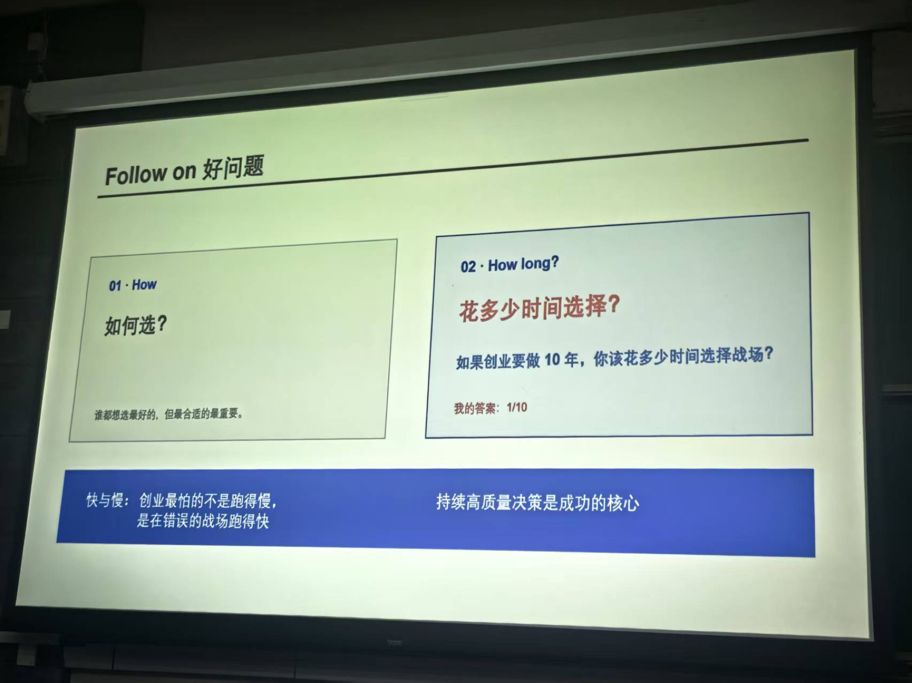
*课件《Follow on 好问题》：01 How 如何选？02 How long？花多少时间选择？答案 1/10；蓝条："快与慢：创业最怕的不是跑得慢，是在错误的战场跑得快""持续高质量决策是成功的核心"。*

### 3.2 选择的三条标准

当然也不能一直耗在思考上，选择还是需要方法论。刘勇不停在思考让方法论变得更通用，总结出**三个规则、三个适用条件、三个标准**：

1. **必须满足第一性原理。** 它不是叙事，而是你的产品必须满足用户的需求、用户愿意用愿意买。从第一性的角度看，这就是微观经济学的基本原理：价格和成本的问题、供需的问题。而且这个价格成本不能放在细枝末节上，要放在**生产要素**这个大变量上。亚当·斯密提出的资本、劳动力和土地，他把能源归入其中（后文会看到为什么是能源）。
2. **必须可量化、可证伪。** 在座 80% 都是学科学的，要用科学的方式：可量化，还要可证伪。不能证伪的，就不去玩它。（这也是他自己的背景使然。）
3. **跨时代。** 在长期周期里被验证过：既能解释历史，更能用历史去预测未来。看赛道时他自己在历史和未来上花的时间基本上一半一半，但历史不会重复，所以两边都要看。
![课件《How 的通用框架需要满足什么标准？》：三张标准卡（第一性原理[解释变量]、能量化能验证[检验关系]、跨时代可移植[指导决策]）+ 蓝条：原理 → 变量 → 阈值 → 决策。](images/slide-02.jpg)
*课件《How 的通用框架需要满足什么标准？》：三张标准卡（第一性原理[解释变量]、能量化能验证[检验关系]、跨时代可移植[指导决策]）+ 蓝条：原理 → 变量 → 阈值 → 决策。*

---

## 04 技术的本质：反稀缺与价值链稀缺转移

### 4.1 技术史的主线：技术是人类的延伸

宏观周期这一部分，标题是"技术史的主线"，出自麦克卢汉《理解媒介》（刘勇强烈推荐，称做互联网的人、尤其是靠谱的产品经理必看）。麦克卢汉的原话大意是：**技术是人类的延伸**，是人身体的延伸、人类器官的延伸。汽车是脚的延伸，电脑是计算的延伸，小到手套也是防冷防热的延伸。

更本质的第一性表述（不在麦克卢汉书上）：**技术 = 工具 + 能源**。人用工具加上使用能量去获得我们想要的东西、满足我们的需求。这就是技术。任何大规模满足需求的技术，都是在做同一件事。
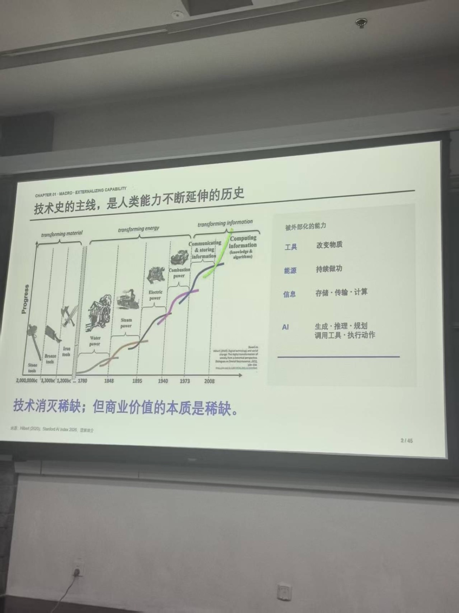
*课件《技术史的主线，是人类能力不断延伸的历史》（2/45）：工具/能源/信息/AI 四段能力外部化曲线；"技术消灭稀缺；但商业价值的本质是稀缺。"*

### 4.2 技术消灭稀缺，商业价值来自稀缺

技术干的事情是**消灭稀缺**（或说得拗口一点：反稀缺性）。

回到第一性原理：**只有稀缺的东西才有商业价值**。空气每个人都需要、需要量无穷大，但它不稀缺，所以没有价格（免费）。水也类似，河边可以随便喝；但今天干净的水就稀缺一点了。

于是出现一对矛盾：
- 技术是反稀缺性的（把成本降到极低，甚至免费）；
- 商业价值一定来自稀缺。

怎么解决？答案是下一条。

### 4.3 稀缺性的转移：价值链相邻环节变稀缺

> 一个东西不再稀缺了，价值链旁边的东西一定会开始变得稀缺。新的稀缺，就是利润的来源。

历史验证：

| 技术革命 | 被消灭的稀缺 | 新的稀缺（利润来源） |
| --- | --- | --- |
| 蒸汽机（动力机械） | 机械动力不再稀缺 | 煤炭稀缺了，做机器的稀缺了 |
| 计算机 | 计算不再稀缺 | 软件稀缺了（软件应用到各种场景，Adobe 今天是 2000 亿美元的公司） |
| 互联网 | 分发变得特别便宜（内容不再稀缺、大家都能看到） | **注意力**稀缺（所以搜索能吸引注意力就值钱）；上下游的**支付、物流**变得稀缺 |
| 移动互联网 | 连接不再稀缺（随时随地连接） | **本地履约**变得稀缺（滴滴、美团本质都是本地履约）；摄像头让内容不再稀缺后，**内容创作者**变得稀缺 |
| AI（本课主题） | ？ | ？（留给思考：价值链上有新的东西变得稀缺） |

这就是第一部分的收束：技术消灭稀缺，商业从新稀缺中来。带着这个问题进入周期部分。
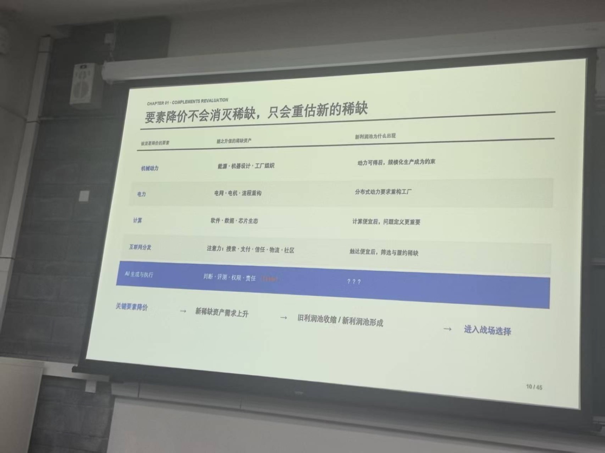
*课件《要素降价不会消灭稀缺，只会重估新的稀缺》（10/45）：五代要素的"随之升值的稀缺资产"对照表 + 链条：关键要素降价→新稀缺资产需求上升→旧利润池收缩/新利润池形成→进入战场选择。*

---

## 05 康波周期：上升期、泡沫与增量市场

### 5.1 为什么用康波周期

技术周期有很多种解释框架（马克思主义、熊彼特等等），刘勇个人最喜欢的是**康波周期**。他发现用它能解释很多东西。康波的核心：从工业革命之前（1800 年开始），已经历了 5 个大的技术周期，而且**每一个技术周期都和经济周期、政治周期、金融周期全部连接在一起**。

看康波他更推荐用**扩散曲线（S 曲线）**的视角，也可以把它弯成类似余弦（cos）曲线的波动来看，这样更方便看清四阶段（复苏、繁荣、衰退、萧条）。

历史的对应（用波动视角看）：
- 第一次蒸汽革命，在大概 1840 年结束（正是中国第一次鸦片战争的年代：别人已经完成了第一次大的技术周期，想想我们也没多远，现在不是赶上来了吗）；
- 第二次是铁路与钢铁；
- 第四次：1937 年到 1982 年，波谷在 1982 年附近。**1982 年**就是前面说的"软件大年"那个数字：波谷的时候反而有好多事情在发生，是一个很好的时间点；
- 最新一轮（以 PC 为代表的信息革命）：1981 年起算，每一轮周期大约 43 年，加 43 年就是 **2024 年左右**。

他自己的判断：上一轮以 PC 为代表的信息革命，在 2023、2024 年左右结束了（标志：2022 年 11 月 30 日 ChatGPT 出现），2024 年开始进入了新的波澜壮阔的大周期。说到这里他很激动，也很遗憾："如果我出生在这个年代，我就不会站在这里，我会去使劲创业了。"但**这个时代属于北大的学生和老师，是最好也是最大的创业机会，因为这个年代比以前更需要技术、更需要底层的技术和基础科学研究**。

### 5.2 康波周期的三个特征

1. **每个周期都是一次能源转化效率的百倍提升。** 技术是"工具 + 能源"转化成满足需求，本质是能源转化效率。上一课 Allen 讲过需求角度的 10 倍提升，但底层的生产效率一定是**百倍**提升。生产力百倍提升，这是大前提。
2. **生产力提升之后，一定会出现一个大市场**，生产关系随之慢慢变化。
3. **最重要：整个上升期（复苏 + 繁荣）是创业最好的时间点，也是资本最活跃的时间点。** 由此推论：每一次技术革命一定会出现金融泡沫，也一定会出现崩盘。

### 5.3 拥抱泡沫：技术革命给普通人的三样东西

大家都在恐惧泡沫，但刘勇认为北大的同学一定要有丰富的想象力：**要拥抱泡沫，千万不要怕泡沫，拥抱泡沫才能够致富**。

为什么拥抱泡沫能致富？因为每一次技术革命都有三个东西让普通人（而不是"老登"们）有机会：

1. **增量市场。** 生产力百倍变化，稀缺被消除，成本降得非常低（之前 100 块的现在 1 块，之前 10 块的现在 1 毛甚至免费）。反例式的疑问：前阵子有位知名投资人说"AI 时代没有增量市场"（以前 PC 有上亿台计算机、互联网有十几亿网民、移动互联网有百亿手机，都是增量用户/设备，难道 AI 时代没有增量？）。刘勇明确反对这个观点：**AI 时代的增量就是 Agent，有上百亿的 Agent 等着我们去调用、管理、交互，这些都是需求，都是新生的市场**。
2. **新老势力同一起跑线。** 新的大市场出现后，老玩家的经验前提不在座各位身上，而新生力量对新东西的理解超过他们。大家都处在同一起跑线抢占市场，老家伙们没有优势。要素价格降低带来新的使用方式，进而带来不同的商业模式。
3. **旧的生产要素级别壁垒被瓦解**（详见后文壁垒部分）。
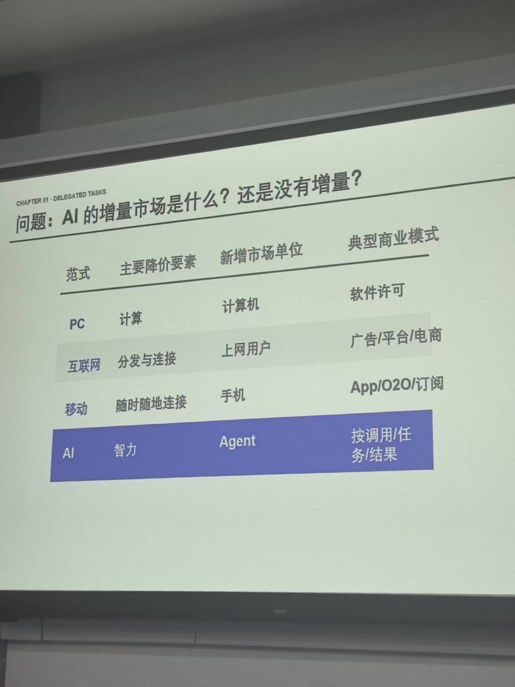
*课件《问题：AI 的增量市场是什么？还是没有增量？》：四代范式表，AI 行（高亮）：智力→Agent→按调用/任务/结果计费。*

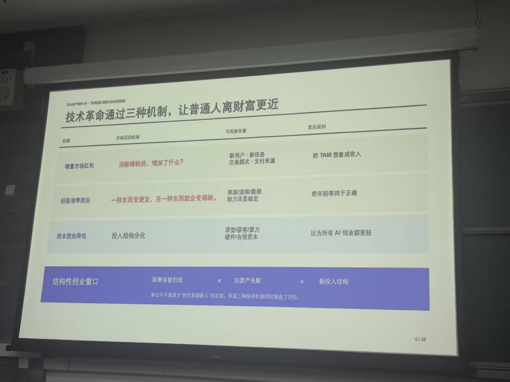
*课件《技术革命通过三种机制，让普通人离财富更近》（4/45）：增量市场红利/经验清零效应/资本壁垒降低 × 可观察变量 × 常见误判；蓝条：结构性创业窗口 = 新需求被创造 × 旧资产失配 × 新投入结构。*

### 5.4 稀缺性转移在各代技术上的表现

技术消灭稀缺、但商业要稀缺，两者的矛盾靠"相邻环节变稀缺"解决（第 04 章表格）。移动互联网的例子再展开一点：它让连接不再稀缺后，**本地履约**变得特别稀缺（滴滴、美团都是本地履约生意）；摄像头接入后内容不再稀缺，稀缺的是**内容创作者**。AI 时代同理：价值链上会有新的东西变得稀缺，**新的稀缺就是利润的来源**。这是留给大家继续思考的问题。

（此处有现场确认环节：刘勇问大家是否听得明白，并建议觉得抽象的同学多去看技术史的书。他推荐的书目见附录 B。）

---

## 06 第一性成本框架：剪刀差决定 PMF

### 6.1 从宏观到中观：把"值得做"翻译成成本公式

第一性原理落到微观经济学，就是**供给与需求、成本与价格**的关系。需求总是以价格的形式出现。刘勇给出一个公式：

> **新的供给成本（左端） < 市场上的老供给成本（右端）= 事情成立**
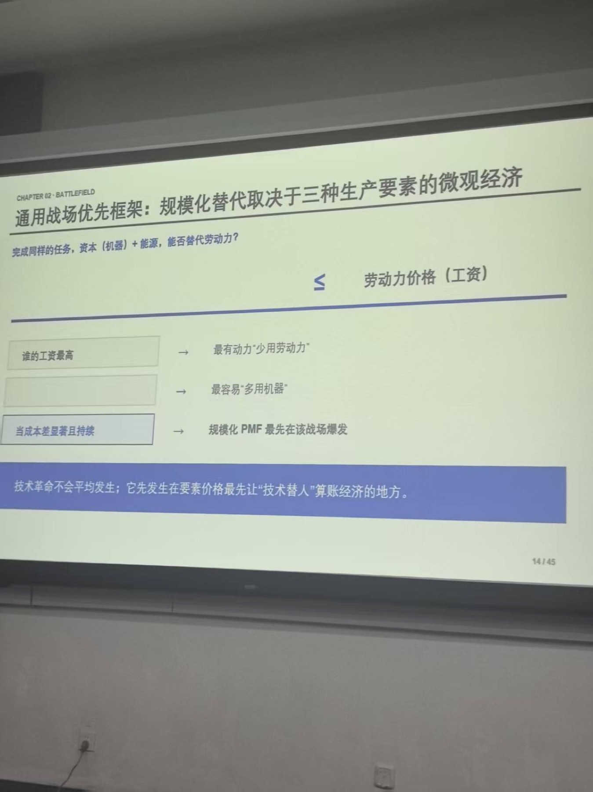
*课件《通用战场优先框架：规模化替代取决于三种生产要素的微观经济》（14/45）：供给成本 ≤ 劳动力价格（工资）；蓝条："技术革命不会平均发生；它先发生在要素价格最先让技术替人算账经济的地方。"*

**右端（需求端）：劳动力的价格转化为工资。** 你每小时要出多少钱给别人干这个事情，或者你自己做这件事每小时的机会成本（北大学生的机会成本肯定比隔壁更高）。这是人口/Labor 这个生产要素的价格。

**左端（供给端）：用机器 + 能源干这件事的成本**，由两块决定：
- **资本（以机器的方式体现）：** 各个时代"机器"的所指不同。第一次康波周期是蒸汽机，第二次是发电机、各种发电机、汽车，今天是电子电脑设备、手机，而 AI 时代的机器就是**大模型**。机器的成本里含有摊销成本。例子：做一张 Excel，之前要花 5 个小时，这 5 个小时是有钱的（工资）。
- **能源：** 把能源转化为满足需求的动力，即煤、石油、天然气、电，今天再加上 AI。

直觉推论：**你给别人付的工资越高，你越有动力去替代他们。** 硅谷的程序员、码农工资很高，所以硅谷天天都想替代他们，替代意愿最强。但光有意愿还不行，还得有能力：你的能源和机器（资本）成本要足够便宜。这就是典型的供给侧第一性：**新的供给成本小于老的供给成本，事情成立**。

### 6.2 剪刀差持续扩大 = 规模化的 PMF

上述公式只表明"可能发生"。但判断赛道时，一定要判断它**持续发生**（上一课朱啸虎 3S 里的 sustainable 也是这个意思）。要持续发生，两边的**剪刀差必须越来越大**：

> 两边差别显著，且剪刀差持续扩大，才是规模化的 PMF。

PMF = Product-Market Fit，产品市场契合。刘勇提醒：这是最基本的概念，跟牛顿第二定律一样，不会就赶快学会。（顺带一个定价的插曲，见 17 章问答：供给端成本还分"客户采购的成本"和"你真实的成本"，中间是毛利。定价建议用你自己的定价（价值定价），而不是用 token 成本定价。）

### 6.3 推论：AI 替代一定发生在"算得过账"的地方

一旦技术革命发生、周期往上走，它发生的地方是不均匀的：**一定发生在机器替代人力、在经济上算得过账的地方**（账就是上面的公式）。

经典案例：**为什么工业革命在英国发生，而不在德国、法国、中国发生？** 有位英国人专门写书讨论过这个问题。最重要的原因：1800 年前后英国工人工资贵，而英国的能源价格便宜（英国的煤在地表，很快可以抽出来）。法国当时人工更便宜（英国圈地运动把人赶出来后，法国人工反而更便宜），而且法国和德国的煤更难开采、能源价格更高。**人工贵 + 能源便宜的地方，机器替代人力算得过账**，工业革命就在那里发生。

公式里还有机器效率、摩擦成本等补充变量，可以自行扩展。

---

## 07 成功率：成本模型中最核心的变量

### 7.1 AI 时代的成本公式多一项：失败接管成本

用这套公式看 AI 赛道，它可以直接回答见 VC 的三个最经典问题：**①为什么做这个（赛道）；②为什么是你；③为什么是现在（时机）。** 这三个问题想透了，其他问题都能在这个框架上找到答案。

但在套公式之前，必须先理解 AI 自己的规律：**AI 摩尔定律**。以前是摩尔定律，现在推理成本的下降速度统计下来是**每年 10 倍到 30 倍甚至 50 倍**（之前一个 20 美元的订阅/百 token 级别的价格，三年之后会便宜到难以置信；三年就是 1000 倍以上的差距）。同时能力持续提升。

在 AI 摩尔定律下，左端（供给端成本）拆成三部分：

> **供给端成本 = 模型摊销成本 + 算力成本 + 失败接管成本**

与过去机器不同的是第三项：**AI 代理产品会失败，失败了还需要人力去介入（接管/修复）**。把这个纳入公式，就必须引入**成功率 p**：

> **总成本 = [ 算力成本 + 失败时人工介入成本 × (1 − p) ] ÷ p**

直观理解：
- 算力成本 ÷ p，等于"做成功一件任务所需要摊的算力成本"（失败重试也要烧算力）；
- 失败了人还得参与进去，而人的成本非常高。

### 7.2 数字推演：成功率是放大器

刘勇做过各种推演，结论非常鲜明：

| 成功率 | 总成本相对放大幅度 |
| --- | --- |
| 90% | 总成本约提升 **2.2 倍** |
| 20% | 总成本约提升 **45 倍** |

**最核心的变量是成功率。** 成功率越低，因失败导致的人工接管成本呈倍数级上升。后面整节课都围绕这个成功率展开。

### 7.3 多步任务：单步成功率的 N 次方

任务的总成功率有一个简单粗糙但非常好用的框架：

> **复杂任务总成功率 ≈ 单步成功率^N**（N = 完成任务所需的步数/子任务数）

任何复杂任务都由 N 个简单任务组成。算一下差别有多大：

| 任务步数 | 单步 95% | 单步 99% | 单步 99.9% |
| --- | --- | --- | --- |
| 10 步 | ≈ 60% | ≈ 90% | ≈ 99% |
| 50 步 | **< 10%** | ≈ 61% | ≈ 95%（讲者凭记忆说"好像是 80%"，按公式 0.999^50 ≈ 95%） |

这就是为什么大家会觉得"大模型什么都能做，但做我自己的事情又不那么顺手"：咱们面临的实际任务全是复杂任务。比如写一个实验的 PPT，大家觉得内容是 AI 生成的，但其实也花了他好多 token 才生成出来。这是一个复杂任务，而且**很多素材是他喂给模型的**；如果不喂，模型要走 1 万步、10 万步，成功率就不可能达标，基本做不出来。

也可以把模型本身看成一个由几个子模块组成的环，用同样的方式分析每个环节的成功率。用这种"成功率 × 步数"的视角去分析，就能更理解**为什么 AI 在某些场景下能完成任务、某些场景下不能**。

---

## 08 中美成本阈值差与国运

### 8.1 中美人力成本差：PMF 先发生在美国

用公式两端做中美对比（生产要素价格对比），结论是：**AI 替代人力的 PMF 首先在美国发生，然后才传导到中国**。

原因：美国的人力成本是中国的 3-5 倍（右端的直线高得多）。供给端成本是一条不停下降的曲线，它先 hit 到美国那条直线，再 hit 到中国的直线。

这解释了一个宏观事实：**今天不管是模型公司还是应用公司，80% 甚至 100% 的收入都来自海外、来自北美和欧美高端市场**，因为他们能付更多的钱、他们的人力成本更高。

这个框架可以用在具体行业判断上：把右端换成程序员、律师、分析师、财务分析师、老师、教授的小时成本，对比左端的供给成本，就可以横向比较不同行业的替代顺序。右端的成本是**可以非常清晰计算出来的**，这是可推演、有数据的宏观逻辑。
课件给出的官方锚点：美国软件开发者中位工资 $133,080/年 ≈ $64/h、律师中位工资 ≈ $72.67/h；中国信息软件 IT 非私营平均 238,966 元/年 ≈ 115 元/h ≈ $16/h（2080 小时、汇率近似）。同一复杂任务的人类成本，美国约为中国的 3-5 倍。采纳阈值：美国机器成本压到约 $60/h 即可触发替代；中国往往要接近 $20/h 才出现相似 ROI。

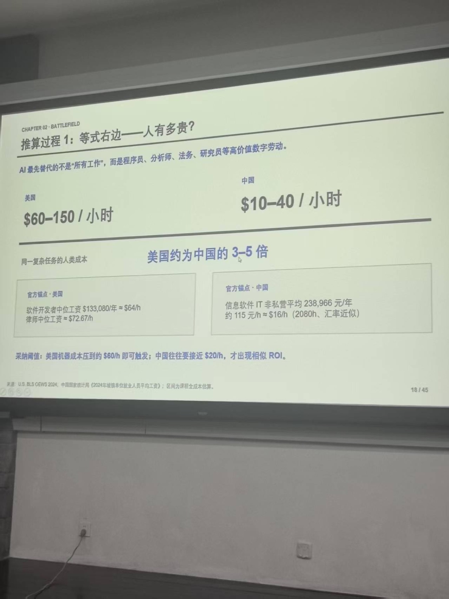
*课件《推算过程 1：等式右边，人有多贵？》（18/45）：中美时薪对照、3-5 倍结论、BLS/统计局官方锚点与采纳阈值。*

### 8.2 中国的优势项：物理世界与制造业

中国也有自己的优势：制造业、数据特点、政府支持等非常多。刘勇认为在**物理世界的自动化**方面，中国和欧美市场发生的时间差异不会特别多（还是会先发生在美国，但按 AI 摩尔定律会传导得特别快），而且中国的供给端成本特别低；反之美国那边由于中美冲突，物理设备的供给端成本反而变高。这一系列因素可以用同一个框架揉进去分析。
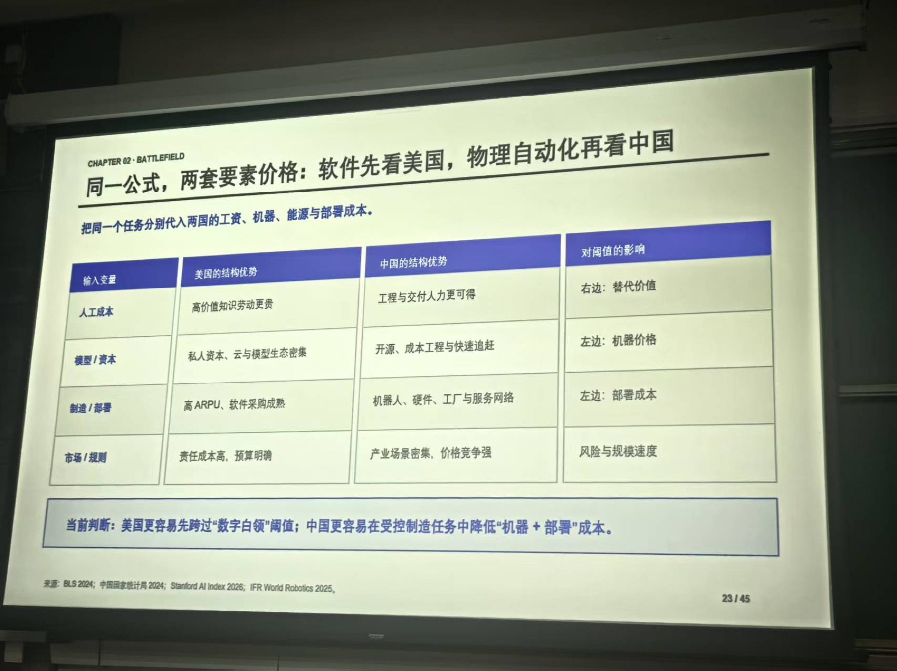
*课件《同一公式，两套要素价格：软件先看美国，物理自动化再看中国》（23/45）：人工成本/模型资本/制造部署/市场规则四行对比；当前判断：美国先跨"数字白领"阈值，中国先降"机器+部署"成本。*

### 8.3 国运：改变生产要素价格的那只手

这个框架里还有一个很重要的因素：**国运**。"我们每个人都是时代背景的产物。"国运这个词很抽象，但可以放进公式里：**它改变生产要素的价格**（左边机器/能源的成本），**也改变客户愿意采购产品的价格**（右端）。

典型例子：中国的新能源车，最早就是补贴起来的（政策改变了两端的价格）。其中一家代表公司（蔚来）也是北大 91 级校友非常成功的创业。把这些抽象的词语转化为可量化、可衡量、可"苹果对苹果"比较的东西，正是第一性方法的意义。

> 紧跟科教兴国的国运，是有深刻的经济学原理在里面的。
课件把"国运"翻译成可观测的要素变量：美国·数字劳动的第一波 $285.9B（2025 私人 AI 投资）、5,427 个数据中心；中国·物理部署的要素优势 54%（2024 全球工业机器人安装量）295,000 台。国运通过要素价格、基础设施与规则改变 PMF 阈值，从而改变创业窗口。

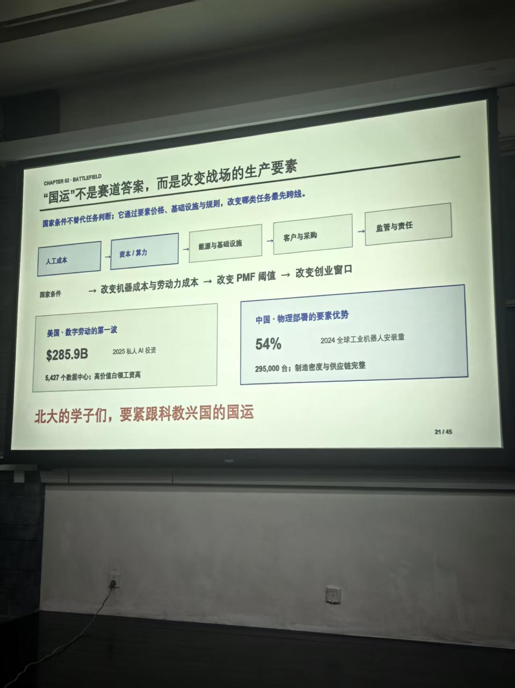
*课件《"国运"不是赛道答案，而是改变战场的生产要素》（21/45）：要素链路 + 中美结构卡 + 红字"北大的学子们，要紧跟科教兴国的国运"。*

### 8.4 为什么这一轮 AI 更依赖基础科学

这一轮 AI 与移动互联网不太一样，国运起的作用差别特别大：模型、资本、制造、部署、软件硬件的整合，很多今天都需要 1-10 的突破，都需要基础科学的支撑，都需要系统性的、高规模的工程。

例子：美国现在第一强的 AI 公司 Anthropic，其 CEO（Dario Amodei）是什么背景？（现场有人开玩笑说"百度一下"）他的背景是**纯理科背景：物理学博士，美国物理奥赛队的成员**，有非常多第一性原理的思考。刘勇并不喜欢这家公司本身，但认为它的很多东西值得去看、值得好好研究。

还有一个行业内的观察：2021-2022 年之前一段时间，做 AI 的人里**专业最多的是学物理的**。这一轮 AI 本是技术科学的突破。清华有很多做智能科学的，北大现在也有很多做智能科学、做强化学习的（强化学习是一个非常数学化的领域）。**从基础知识转化为产业的路径非常短**，这也是他特别希望老师们也来听听课的原因。

---

## 09 赛道标准：新、大、快；壁垒 = 快 + 独特数据

### 9.1 成立之后才谈得上：新、大、快

成本阈值过了（成立了），接下来是通用共识层面的赛道审核标准。刘勇他们在蓝驰提过一个提法（转写作"新大块"，按上下文应为**新、大、快**），可以拿来审核自己的商业 idea 是否好：

1. **新：增量市场出来了之后，大家都不懂。** 你也不懂、别人也不懂，关键是**你可能比别人用得更多**，你脑袋里没有障碍。
2. **大：** 阿里也讲 3S，第一个 S 就是 significant（转写略有失真），规模要大。
3. **快：** 在 AI 时代，更重要的是**快速起规模**，scale 一定要快。

### 9.2 AI 时代的核心竞争力：唯快不破

> 今天 AI 的核心竞争力是什么？天下武功，唯快不破，使劲快就行。

为什么要快？因为"AI 公司的壁垒是不是资本壁垒？"很多人的第一反应是没壁垒。上一课艾伦总也讲过可防守性（defensibility）的问题。**今天一个最重要的问题就是：凭什么你做的这些事，模型公司不会做？**

现场有同学（问题见 17 章）担心：哪怕我的市场起得很快，模型公司降维打击怎么办？刘勇给出的"相对标准的答案"是：

> **模型公司也会做，但是你跑得比它快。**

这是第一个层面（执行层面的快）。第二个层面是选赛道的时候要慢下来：做大决定一定要慢下来（详见第 03 章 how long：8-10 年出一个独角兽，就要花几个月到一年好好思考战场与差异化）。

AI 的节奏确实快：大模型两年就出一代公司，所以你出的也要特别快。他回忆 2023 年 2 月就跟小川说："不是说你是最适合做大模型的吗？卡一下冲进来，砸个二十几亿，然后使劲干，可能就会比别人（更快建立优势）。"

### 9.3 非模型公司的壁垒：快 + 独特私有数据

模型公司的壁垒不是应用层的事。对非模型公司（应用层）而言，壁垒就两个：

1. **快**（快速起量）；
2. **数据**。回到 AI 三大要素：**算力、算法、数据**，哪一个会潜在成为你自己的核心能力、核心竞争力？是**数据集**。而它能不能成为核心竞争力，还是要回到稀缺性：**必须是你自己独特的数据才行，非独特的数据不行**。

（现场有同学问：AI 产品是不是要等市场/技术成熟？见 17 章。刘勇的回答涉及"技术成熟度"与"机器人什么时候到 ChatGPT 时刻"，见第 11 章。）

### 9.4 定价：用你的定价，不是 token 成本

有同学问到供给端成本、客户采购成本与毛利的关系（不同公司有不同打法，这是定价战略）。刘勇的建议：**今天既是创业公司又要赚钱，定价就不能过低。要用你自己的定价，而不是用你真实的成本（token 价格）去定价。** 你本来做的就是把 token 的价格以更高的价格卖出去（中间是你的价值），所以按你的价值定价。

（另一个插曲：做公司是一连串的决策，决策质量要高。定价没有标准答案，但一定受竞争和你想要的增长速度影响。如果是百团大战那种竞争格局，那就什么都不要管、先把量做起来（质量低一些也要上，但不是无限低）；如果竞争没那么大、你还能拿到锁定的资源，就可以慢一些。总之今天要快：AI 的边际执行成本趋近于零，你比别人快卖一天，才能卖出溢价。）

---

## 10 快与慢的边界

现场提问：**尊重时间、尊重经验的"慢公司"（例如泡泡玛特式的沉淀）和 AI 公司"唯快不破"之间，平衡点在哪里？**

刘勇认为这是一个对立统一的问题，创业者（尤其偏理性的创业者）的优势就在于可以去思考各种东西的边界。好与坏没有统一标准（除非是纯好纯坏），关键是**中间的边界是什么**。

泡泡玛特这种方式和 AI 公司（或者以前百团大战那种唯快不破）都是有边界的：

- **泡泡玛特/内容 IP 的边界：** IP、内容是需要沉淀的，**快不来**，这是每一个东西固有的属性、内因。刘勇自嘲看不懂泡泡玛特（"没准在座的零零后看得懂"），但他第一个公司的联合创始人麦刚是泡泡玛特的天使投资人（200 万人民币进去，赚了 N 倍，N 等于一千还是五千）。刘勇认为麦刚也不是完全"看懂了"，但麦刚比他更有人物气息（人大经济系、有才华、更懂年轻人），**只要比你更懂，他就敢愿意花钱进去**。
- **大模型上的应用：** 今天大模型的很多东西都是可替代的，不需要慢。当你不需要慢的时候，就可以快。
- **判断方法：从业务内生的属性去思考，这才是真正的边界。** 例如：
  - 你做**企业市场（大 B）**，在中国一定快不起来，就慢慢去做；
  - 你做**海外 consumer**，面对强大的竞争（这是外部竞争属性），就必须快。
  - 价值链的不同环节、外部竞争属性，共同决定了你应该快还是慢。

再回到成本要素上想：你的成本能不能快速跨越？别人能不能把成本压得比你更低？这都可以回到自然（生产）要素上去衡量。

---

## 11 大模型格局已定：应用层的两层机会

现场提问：**大模型是不是可替代的？大模型（复杂能力）的未来怎么看？**

刘勇在硅谷交流后的一个明确判断：

> **这一轮大模型的竞争已经结束了，game over。这是指格局已定**，不是说不会有新架构出现。

- 短期之内，即便有新的玩家出来（有同学提到"leo labs"，转写如此，疑指某新架构模型公司；转写中"新的价格"应为"新的玩家"），它们的竞争力目前也不如头部这三四家强。
- 中国很牛的一件事：闭源之外，**中国占住了开源的入口**。总之**开源和闭源结合起来用就好**。
- 但今天你要去做新架构、做原来路线的大模型，**一点机会都没有**。
- 不过：**在技术还没有完全成熟、但你相信技术可以成熟的时候，还是值得去尝试的。** 今天中国做 RSI（递归自我改进）等等，他认为还是值得去尝试的。再尝试的机会来自两方面：①RSI 或别的方向上会出现新架构的模型；②（第二层机会）还比较远。

与之相关的另一个现场提问（同学说：上一轮创业的经验"完全不适用了"，以前要等技术成熟再看商业，现在技术不成熟、商业也看不清，怎么办？）刘勇的回答：

- "等技术成熟再进"的判断来自：你是下游、是 GPT 之后的应用者。**只要技术不完全成熟的时候，你一定要杀进去**：技术虽然不完全成熟，但你已经感觉到它快成熟了。
- 经典的问题：**机器人/具身智能什么时候能到 ChatGPT 时刻？** 现在的共识答案是 **3-5 年**。所以如果做"通用机器人"，今天 3-5 年之内还不一定是最好的时机（指真的做通用机器人）。
- 但有另外一种做法：**你的概念是通用机器人，但你真实做的可能不是通用机器人**。这是技巧，前提是你对这东西理解了、能迎合市场的需求。你既要拥抱泡沫，又要坚持自己的东西。
- 人形机器人今天的泡沫为什么大？因为大家觉得它 3 年之后就可以通用了。但注意：**一旦共识了，就不具备稀缺性了**。非共识才稀缺；共识的东西在商业上已经没那么值钱了。

刘勇补充：市场与技术两个都要看，但不可能什么都看得那么明白，**一定要抓一个最主要的变量**（driver）。AI 时代最大的变量是**技术/模型技术**（AI 摩尔定律的迭代速度是以前摩尔定律的 10 倍级）。需求常在（尤其是付费需求一直都在），**变量在时机**（why now）：技术导致成本按 AI 摩尔定律下降、能力按 AI 摩尔定律上升，去预测它。

---

## 12 时机：需求常在，机会窗口只是偶尔开放

刘勇的一句"抱怨"式总结：

> **需求常在，机会窗口只是偶尔才开放。**

以**自动化编程**为例：每家公司都想做，需求一直存在。但直到 2025 年 5 月，这类产品才达到"程序员正常很愿意去使用"的可用线。在那之前都不行。而在这之前，真正的**战场窗口只有 87 天**。

### 12.1 Manus 案例：87 天窗口

2025 年上半年，中国出了两家现象级的 Agent 公司：一家是 **Manus**（也是后续要邀请来的嘉宾），另一家是蓝驰投的（转写作"james park"，产品 4 月 8 日发布，存疑）。它们分别在 2025 年 3 月 6 日和 4 月 8 日发布产品。

为什么是那个时间点？因为 **2025 年 1 月 DeepSeek 开源了自己的 R1**。一旦开源，Agent 框架（不停的推理 + harness 工具调用）就有了基座：Manus 等大量借助了这个框架做出自己的通用 Agent。从开源到发布，整个窗口只有 2-3 个月，**只有 87 天**。

结论非常残酷：
- 6 月之后，再做所谓"通用 Agent"这种公司再也不可能成功，因为模型自己已经做到那去了（模型自带框架，不再需要外挂）；
- 窗口期内只能拼命狂奔（7×20 小时地干），87 天发布产品；
- **如果你的能力拐点很大，窗口期内才开始重新组团队，早就没戏了。你必须在拐点来临之前就等在风口上**（怎么等、为什么要等，见下一章）。
Claude Code 的完整时间线与"87 天"口径见课件：

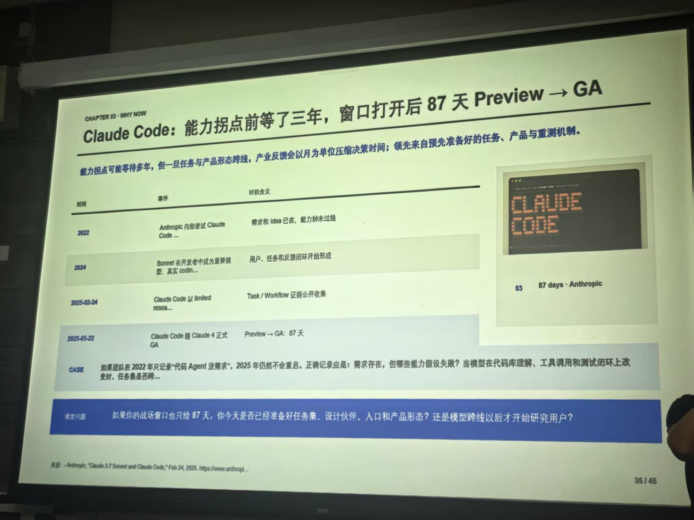
*课件《Claude Code：能力拐点前等了三年，窗口打开后 87 天 Preview → GA》（35/45）：2022/2024/2025-02-24/2025-05-22 时间线表 + CASE + 课堂问题。*

---

## 13 能力拐点：阶跃函数与提前蹲守

### 13.1 模型连续进步，机会是阶跃函数

基于"单步成功率^N"的框架看不同任务：有的任务 10 万步（如新药），有的任务 100 万步量级（如菲尔兹奖级数学问题，转写失真存疑）。**模型是连续进步的，但你的机会是不连续的、突然打开的，是一个阶跃函数。**

以 Coding 为例（此处 PPT 上未写出 Claude Code，沿用他口头展开）：任务成功率从 10% 慢慢涨到 20%，又涨到 30-40%，然后**一下涨到 60-70%，你就知道：OK，你成了**。这就是为什么要提前做、在市场还没有成熟的时候做：你在沿着反馈速度相信它一定会成熟，按照测量/评估昨天和今天的数据去看未来。

### 13.2 Claude Code 案例：为下一代模型做产品

Claude Code 的时间线：
- 22、23 年就想做，24 年产品已经出来了（负责人 Boris Cherny，转写作"boris"），但特别不好用；
- 但他看到内部模型能力变化比较快，所以决定**先做出来**；
- 2025 年 1 月勉强可用（对应 DeepSeek R1 同期的能力环境）；
- 2025 年 5 月 22 日发布了 Opus 之后，任务成功率**突然上升到 60-70%**。

**所有的成功公司都是在为下一代模型做产品**，Claude Code 就是典型（Anthropic 自己在为下一代模型做产品，更何况应用公司）。

### 13.3 怎么"等在风口上"：理解模型的能力曲线

要为下一代模型做产品，你必须理解模型，也就是理解**模型的能力曲线**（过去、现在、未来）。具体抓手：
- 看 benchmark、建自己的 evaluation、看步数、看能力拐点，看哪些东西在快速变化；
- **今天要把过去的 evaluation 全部更新**：benchmark 不变是不对的。在复杂任务的情况下很多东西已经变了；"今天把北大学生会做的小学题都去掉，那才不是你们的边界"（例：题库里已经完全掌握的题目要剔除，能力边界（会与不会之间那条缝）在移动，evaluation 要跟着移动）。

AI 产品经理的最终定义见第 15 章：**找需求曲线和能力曲线的交点**。这对技术能力的理解比移动互联网时代高特别多倍。

---

## 14 战场优先：反馈速度、打分与可验证性

选战场除了赔率（战场决定赔率：给 1 块钱能赚多少钱的倍数）和切入点（切入点决定胜率，例如滴滴从租车市场切入，上一课艾伦讲过；创业者要学会判断胜率，但相比投资者没那么重要，因为你有足够时间去磨），还必须看 AI 替代的两个结构性因素：

### 14.1 反馈速度

供给端成本要低，反馈速度必须非常快：
- **Coding：反馈速度最快**，下一秒钟结果就出来了；
- **数学**之所以能更快突破（菲尔兹奖级问题），也与反馈速度快有关（对错立判）；
- 化学/生物实验的反馈速度也较快（做 AI for science 的朋友讲的，刘勇说这块他不是特别懂）；
- 反馈慢的领域（如理论物理，验证周期长）就更难。

反馈速度是所有大模型公司和 500 强公司主线里都在看的因素。

### 14.2 可验证性与打分（grading）

反馈速度的前面一步是**打分**：
- 标准化的题目（如 Coding）打分非常容易；
- 非标准化的目标/题目，需要你自己花精力去定义打分标准。

与数据经济直接相关：大模型 post-training / fine-tuning 时的 **RLHF（Human Feedback，人工反馈打分）**，一条数据相当贵。2023 年刘勇去硅谷时这还是核心秘密：**OpenAI 一条 RLHF 数据要花大约 100 美元**。今天高质量的标注数据非常非常贵。

所以今天数据公司一个很核心的能力就是 **grading（打分）能力**：有了 grading，你就能对数据快速反馈，你就比别人快。这就是"可验证性"的商业含义。

---

## 15 AI 产品经理：为下一代模型做产品

刘勇专门加了两三页 PPT 讲 AI 产品经理（移动互联网训练出的优秀产品经理范式在 AI 时代不一样了）。他研究下来，AI 产品经理有三个关键点：

### 15.1 挑赛道/挑创始人：可验证性三要素

挑选赛道、包括看 founder 时，看**赛道的可验证性**：
1. **反馈的速度**（多快能得到对错信号）；
2. **可标准化程度**（能不能自动打分，即 grading 的难度）。最标准的赛道就是大模型最先突破的地方：Coding、数学、AI for Science。理论物理还要更难一点（理论物理的验证本身也难）。

在想自己的赛道时，可验证性、标准化程度、可验证速度是必须考虑的维度。数据公司尤其要把 grading 能力建起来（见 14.2）。

### 15.2 建 Evaluation，而不是看 Benchmark

OpenAI 怎么做自己的产品？他们自己的产品经理在做的东西叫 **Evaluation**。注意：Evaluation **不是 Benchmark**。
- Benchmark 是宏观的、公共的数据集；
- **Evaluation 是你自己垂直场景下的任务集**：你自己要做 20 来条任务（他有一期视频里专门取了近 7 条举例）。
课件把评测集的记录要求拆成四层：Task（用户目标、输入、限制、合格结果）、Environment（工具、权限、状态、版本、异常）、Grader（规则、单元测试、模型、专家、业务结果）、Failure taxonomy（能力失败、工具失败、权限失败、状态失败、风险违规）。CASE：法律合同 Agent 的任务集不能只放十份标准合同，还应包含扫描质量差、条款冲突、权限不足、附件缺失、跨语言和必须升级专家的失败样本，否则高分只证明演示环境被优化。

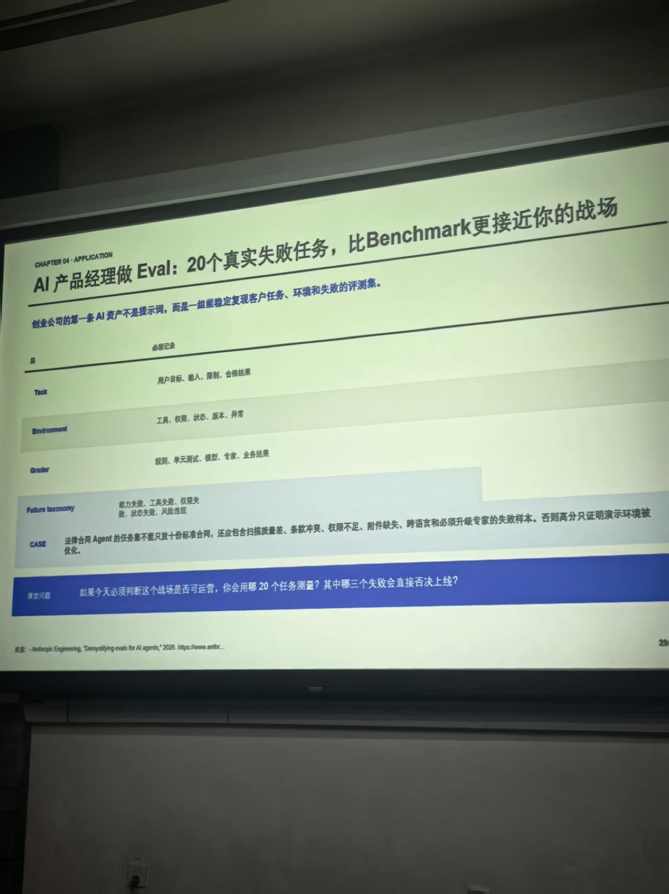
*课件《AI 产品经理做 Eval：20 个真实失败任务，比 Benchmark 更接近你的战场》（29/45）：四层记录表 + 法律合同 Agent CASE + 课堂问题。*

### 15.3 找瓶颈（breake/breakeven 处的提升，转写作"breeding"）

某个环节效率突然提升之后，别的环节就会出现瓶颈。你要想到去提升瓶颈处的价值。这和稀缺性转移是一个道理：**AI 技术变得毫无稀缺性之后，边缘/相邻的价值链上什么东西稀缺了，价值就在哪里**。找到瓶颈、提升瓶颈，你的速度就会上来。

### 15.4 为下一代模型做产品 + 需求曲线 × 能力曲线

围绕这个的最重要结论（再次强调）：

> **所有的成功公司都是在为下一代模型做产品。**

要为下一代模型做产品，你必须理解模型的能力曲线（过去、现在、未来），看 benchmark、看自己的 evaluation、看步数、看能力拐点（例如某任务成功率从 10%→20%→30-40%→60-70% 的那条曲线就是 Claude Code 的曲线）。同时今天要把过时的 evaluation 清掉（能力边界在移动）。

> **AI 产品经理是要找需求曲线和能力曲线的交点。**

他对技术能力的理解要求比移动互联网时代高特别多倍。否则你做的东西"别人也没错，模型也能做"。
课件的"冲浪三天法"把重测机制表格化（见下图）：测量今天，重估昨天，预测明天。原失效假设按"新模型可能改变吗"分类，配触发事件与重测方法（固定任务集多次 trials；重算 B 与 Cq；影子流程测 H）。

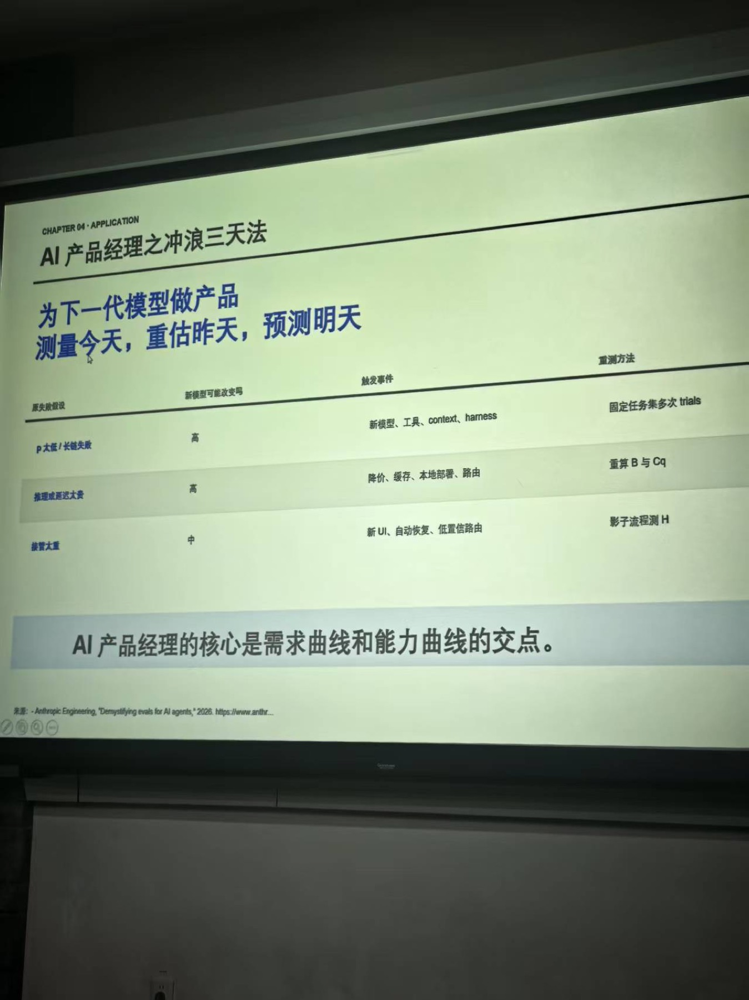
*课件《AI 产品经理之冲浪三天法》（36/45）：重测表 + 蓝条"AI 产品经理的核心是需求曲线和能力曲线的交点"。*

关于 AI 产品"能不能做个 demo 就上线"：他倾向于赞成 Stripe CEO 的说法（今天 AI 产品不能只做个凑合的 MVP 就上线），因为今天的供给能力已经非常好、用户自己也在用 AI，标准应该是**既要快速迭代、快速上版本，又要每个版本相对比较好**。"做一个 demo 就去给客户试用"的时代已经不完全存在了。同时 AI 产品经理要懂需求、懂供给（今天的很多需求是从 B 端生产侧来的，要理解生产力效率什么时候被替代）。有意思的一点：**今天 AI 产品对"人性"的理解要求可以不像移动互联网时代那么高**。所以他跟他投的一些 portfolio 公司说：你不用去找过去那种移动互联网式的非常优秀的产品经理，两者要的 criteria 完全不一样。

---

## 16 案例：Cursor、Abridge 与硬件机会

### 16.1 Cursor：模型可替代的口径下怎么打

Cursor 2023 年开始做的时候，Coding 模型还不成熟。它做了三件事避开与大模型公司的正面竞争、构建差异：
1. **接入多个模型**（在 Anthropic 决定自己做 Coding 产品时，多模型策略帮助它避开直接竞争）；
2. **自己做专用模型**，让专用场景上的推理速度更快、更好；
3. **IDE 形态**本身构成一定程度的差异。

所以它增长超级快。回到根本问题：**这个战场究竟还存不存在？答案是肯定的。** 因为今天 Cursor 们让全球可能有 10 亿人能够写 code（成为 coder），这是 AI Coding 的巨大机会。

但是再回到要素上分析：反馈速度有多快？能否标准化？要素成本是否便宜？就会发现：**有机会，但很可能不是创业公司的机会**（Coding 对创业公司的机会已经不大）。若一定要做，机会在海外、更靠近需求侧，而不是供给在国内。最终 Cursor 自己 4 年做到 600 亿美元估值：**只要你跑得快，从全局去思考，你一定找得到一个最佳的方案。** 太多大公司想进入这些市场、它们的规模特别强，跑得快才有机会。

### 16.2 Abridge：数据壁垒的样板

客服/医疗文书案例（转写作"a bridge"，即 Abridge，上一课阿里相关背景也提过）：这是**完全有数据壁垒**的生意，不是公用数据，所以有戏。最开始做得很简单：**帮医生写病历**。在美国医生人力成本特别高的情况下，很容易算得过账、容易替代。

中国的场景不一样（生产关系挺麻烦的，跟小川也交流过），要找那些**生产关系相对简单、监管门槛没那么高**的场景，或者类似的、有数据壁垒的东西。

### 16.3 硬件与中国变量

机器人/具身智能方面：今天一定要看硅谷，但要拿出中国四个要素的独特地方（尤其硬件），在科教兴国的国运下，具身智能是中国在 AI 行业和美国竞争的一个抓手。

关于中美投入差距（此处 PPT 左下角有数据对比，转写严重失真存疑：硅谷一级市场在 AI 上花的钱约 300 亿美元量级、中国约 12 亿/百亿量级，另提到 3 万亿等数字，无法确认）。大意是：**一级市场的投资差距这么大，就不要完全想着在算力、算法上一定要比对方好**（对方能花更多钱找更优秀的人才，你培养出来的人才也会被挖走），**而是要真的去找我们自己的变量**。

硬件的具体机会（见 17 章问答）：眼镜（数据获取能力还不够）、手表（模态不够）都还没到，但像 Plaud 这样满足真实刚需的产品很好；宠物需求等也值得看。建议大家去 CES 看看硬件：那些硬件细分每一个都能做到 10 亿美元规模的赛道。

---

## 17 问答实录

课上零散的现场追问已按内容归入正文相应章节：定价与毛利（见 06/09 章）、模型公司降维打击与"快"（见 09 章）、快慢边界与泡泡玛特（见 10 章）、大模型格局与机器人时机（见 11 章）。以下为课程末尾集中问答（01:32-01:50），每一对问答完整保留。

### Q1：如何看待 AI 创业中 To B 和 To C 的差异？

**刘勇：** 还是回到那个公式。右端是人力替代成本：To C 替代的那个人力成本（个人的时间）是很低的，所以那条线（替代是否划算的临界线）用这个公式算就很明显：To C 今天还没有到（替代线）。而 To B 是一定有机会的（已经占领了），去找那些**人能被替代的、高人力成本的地方**。

### Q2：国内市场怎么看（从软件 application 的角度）？

**刘勇：** 我推荐的还是：**中国做供给（团队），市场做在海外，尤其欧美**。如果你是做硬件的，可以两边同时并行：在中国先做到 PMF 甚至规模化，然后出海。（此处转写失真存疑：收入结构上中国大约能占近一半。）

### Q3：一个 AI 产品在 launch 之前，哪些维度是必须满足的？AI 产品经理的 benchmark 有哪些评价标准去判断它是否合格？

**刘勇：** 非常具体的问题。今天 AI 产品有两种说法，我倾向于 Stripe CEO 说的：**今天 AI 产品经理不能只做个凑合的版本就上线**（转写作"map"，按上下文应指 MVP/demo），我挺赞成，因为今天的供给能力已经非常好。你说的标准，我认为是**既要快速迭代、快速上版本，又要这个版本相对比较好**。"做一个 demo 就去给客户试用"已经不完全存在了（客户自己也在用 AI）。另外 AI 产品经理要懂需求、也要懂供给：今天的很多需求是从 B 端生产侧来的，要理解生产力效率什么时候被替代。我认为**今天 AI 产品对人性的理解，可以不像过去移动互联网产品要求那么高**。所以我跟我投的一些 portfolio 公司说：你不用去找过去那种移动互联网式的非常优秀的产品经理，两者要的 criteria 完全不一样。

### Q4：AI 硬件怎么看（眼镜等新形态）？

**刘勇：** 现在大家觉得最火的东西（眼镜等）还没有完全出现。**至于手表，它的模态是不够的**，模态不够意味着获取数据的能力不够。回到三要素（算力、算法、数据），这些设备获取数据的能力是关键。眼镜今天还没有完全（成熟），但即便如此，还是有一些不错的硬件赛道：**Plaud** 是一个真的、非常刚需的需求；去满足宠物的一些需求也可以。强烈建议大家去 **CES** 看看硬件：那些硬件细分，每一个都能做到 10 亿美元规模的赛道。

### Q5：创业选通用场景还是垂直场景？（提问同学提到朱啸虎老师上节课说今年上半年大家主要围绕模型和基础设施，垂直场景感觉对大家来说更适合。）

**刘勇：** 今年上半年确实主要围绕模型和资产（infra 属性）。也有垂直场景，但做出一个场景对大家（学生项目）来说……从长周期来看，我建议去**更通用的场景**；但如果你觉得自己的能力不太够，从硬件或软件切入，有很多小的垂直场景可以做。举个例子：**视频生成的 GPT 时刻**，去年我在硅谷得到的趋势判断是（在今年、明年之交达到），我在那个时间点就告诉我的一家 portfolio 公司：**到那个时候你就应该去做跟视频生成相关的**。跟视频生成相关的场景特别多，有的还可以做图片审美等等，不一一举例了。确实可以自己去思考，快速做一个工具出来尝试。

### Q6：怎么看待"被大公司占领的市场里的很新的产品和创意"？（小需求与大市场的矛盾，专注还是散点尝试？）

**刘勇：** 今天这个矛盾可能更突出（别人可以很快抄）。要这么看：**你的竞争对手全是分层的**。你去专注做一个小需求，做到 0-1 的垄断性，这个垄断性（尤其你积累的数据）可以让你继续往前走。如果你还不具备一定的防御性数据，那你就**撒网式地散点尝试各种小市场，直到找到那一点为止**。回到时间原则：如果你 3-5 个月就要换一个赛道，用 1/10 的原则，你可能 0.3-0.5 个月就该想清楚下一个是什么。

### Q7：（Lorry）AI 让更多人可以做出产品、更多 one-person company 涌现。作为连续创业者/投资人，AI 时代创业公司如何判断：哪些能力用 AI 快速补足（30-70%），哪些能力需要关键人才来建立？

**刘勇：** 有一个比较简单的判断：**凡是跟人打交道的，依赖关键人才；凡是基本不需要和人打交道的，可以用 AI（或调教/训练 AI）快速培训补足**。

### Q8：AI 的壁垒在中国很多是公共数据/公共部门数据。数据集这个赛道，会由什么样的主体或个人挖掘出来？（以及个人在其中的悖论）

**刘勇：** 先说中美对比，这其实不是悖论而是机会：**中美之间，美国获取数据的摩擦成本远高于中国**。所以在中国做数据公司：中国获取数据的成本小、量多，且中国的数据公司基本功还是非常靠谱的（中国人特别擅长）。**数据这个赛道是非常大的**，安全（数据安全）也应该是大家都在争的一个赛道。为什么说这个赛道大？可以相对标准化地出题打分：比如做 PPT，我给他们要求"达到某某标准、三份 PPT 的要求"，他们就真的不停地迭代，还行。我是把数据输给它的（有数据喂养 + 有 grading 标准，就能形成壁垒）。

### Q9：对于医疗这样不光受三要素影响、还受监管影响的行业，什么时候是比较好的进入时机？（提问同学提到"一张 A4 纸就可以（改变行业）"）

**刘勇：** 医疗对一般人来说，**如果是有监管的，永远不是一个很好的经济时机**，除非你能够降低你的摩擦系数，或者跟医院有深度合作（跟别的公司合作也可以，但最后别的公司为什么要选你？关键还是医院自己相关的利益，跟他们一起合作才行）。今天（美国的）Abridge 也是这样（见 16.2）。大赛道的话，对其他公司不容易、很难，因为没壁垒：获取数据没壁垒、算力没壁垒、你的快也没壁垒，腾讯的人也在使劲干。

### Q10：那像做 PPT 这类大赛道的产品呢？

**刘勇：** 这样的东西大家就别去搞了。今天原来一些做 PPT 的（公司）也不容易。如果一定要去，就**去海外做 C 端产品**。但今天海外的通用场景也不行，垂直场景这些也都在做（OpenAI、Sora 这些全都在做）。另外也有以开源方式来做的路径，但开源的红利在中国已经见顶（转写存疑），完全没有壁垒，你靠快都快不过。**不过如果你拥有数据的壁垒，那还是值得做**。总之还是值得尝试一下，积累一点经验没关系。

### Q11：硅谷的 YC 等 batch 更多押注 harness（智能体框架）或硬件赛道；内地 VC 的情况是否不一样？是不是 APP 或 SaaS 是更好的机会？

**刘勇：** 两边的需求不一样，差别还是很大的。美国更愿意投 To B（今天讲的这些基本都在 To B 上）。在中国，要结合中国自己独特的要素和优势，还是要联系到国内去。**我觉得大家可以看看新闻联播，今年创业还挺需要新闻联播的**（政策导向即国运变量，见 08 章）。

### Q12：怎么看 FDE（Forward Deployed Engineer，转写作"fde"）这种模式？它和规模化之间的张力（像售前、consulting，难规模化）怎么理解？

**（注：该问题在逐字稿中有提问记录，但刘勇的回答未被录音覆盖/转写散佚，此处仅保留问题。）**

### Q13：你今天讲的很多决策（包括投资）里面有很多数学的东西。你在第一次启动创业时，是更偏向数学一点，还是商业一点？

**刘勇：** 我觉得我还是更偏向于数学一些。除了判断人的时候（跟人打交道的部分），其他只要不跟人打交道，都可以用很多第一性的东西去实现。**第一性原理很值得大家深入去研究。**

### Q14：AI Coding 解决的是计算机/软件工程的问题。像机械工程、电气工程呢？（提问同学提到 AI 写 PCB 板写得特别好。）大模型在物理世界的边界是什么？

**刘勇：** 我把这个问题转化为另一个问题：**大模型在物理世界的边界是什么？我目前的答案是：凡是"可以被编程的"物理实验/工程，都在大模型的能力边界之内。** 所以你说的电气工程的很多东西（比如 PCB 板设计，本质上是可编程的 EDA 问题）大模型都能发挥；而机械工程里很多人不可编程（依赖实体经验、物理接触）的环节，则受限于此。**这（不可编程的部分）就是咱们中国制造业的优势。**

（收尾：刘勇说"你们已经多听了 20 分钟了"，宣布正式下课，后续问题课下继续交流。）
**尾声：结束寄语**

课程最后的 PPT 停在北大《AI创业与投资》的寄语页："为科技立心，为产业立命；为后学传薪火，为时代造英雄。"以下为现场照片。

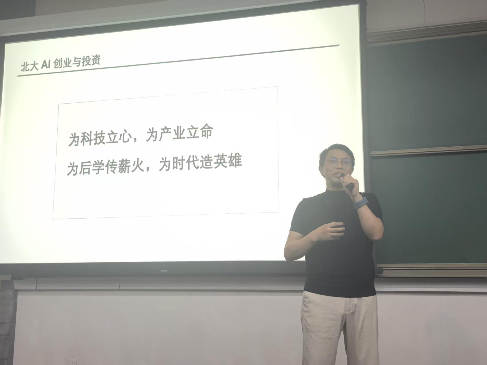
*现场：刘勇在结束寄语页前讲课。*

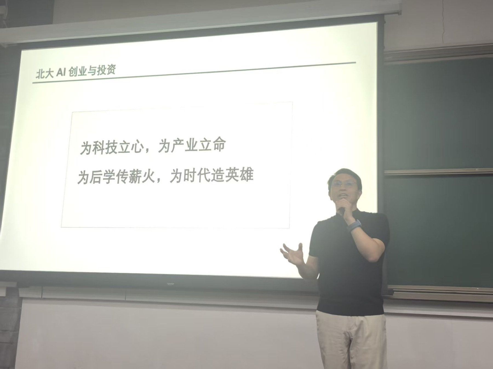
*现场：结束寄语页前的刘勇（手势讲述）。*

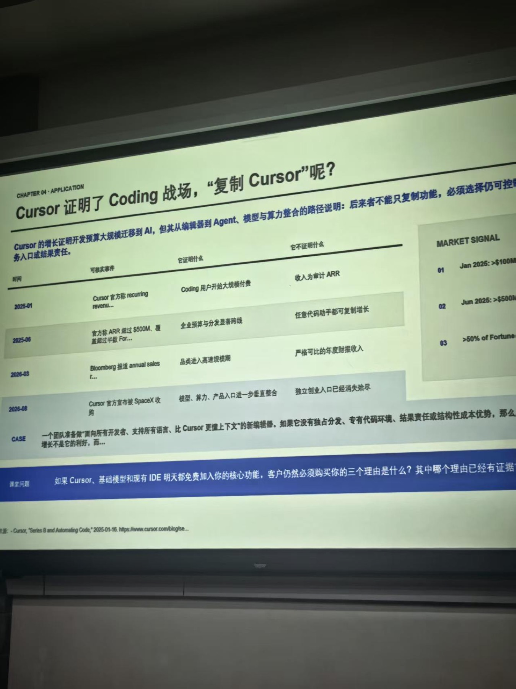
*现场：结束寄语页前的刘勇（双手摊开）。*

---

## 附录 A：转写勘误与存疑对照

| 转写原文 | 应为/处理 | 说明 |
| --- | --- | --- |
| Joyce | （录音账号名） | 全场标签均为录音账号，非讲者 |
| 周小虎 | 朱啸虎 | 第二课主讲人 |
| 蓝池 / 南市 | 蓝驰（创投） | 刘勇 2021-2026 年任职机构 |
| cloud code / Cl code | Claude Code | Coding 产品案例 |
| 泡沫玛特 / 泡玛特 | 泡泡玛特 | 麦刚天使投资案例 |
| 百车大战 | 百团大战 | 竞争格局类比 |
| 马龙们 / 生活们 | 码农们 / 程序员 | |
| 写漏子 | 写病历 | Abridge 案例 |
| deepseek 开源了自己的 ry | DeepSeek 开源了 R1 | 2025 年 1 月 |
| GMF | PMF | |
| harris 的工具 | harness 的工具 | Agent 框架 = 推理 + harness |
| 圣女切入点 | 绝佳切入点（存疑） | 转写失真 |
| 新大块 | 新、大、快（存疑） | 按上下文归纳 |
| X SIX G（Q11 提问中） | 存疑 | 硅谷某机构/加速器名，无法确认 |
| leo labs | 存疑 | 疑指某新架构模型公司 |
| 101（"做你这个东西的101涨到10%…"） | 存疑 | 疑指某任务/指标的成功率曲线 |
| 菲尔斯讲系列 | 疑指菲尔兹奖级数学问题（存疑） | |
| james park（4月8日发布产品的公司） | 存疑 | 蓝驰投的另一家现象级 Agent 公司 |
| 中美一级市场投入对比数字（300亿/12个病人/3万亿等） | 存疑 | 转写严重失真，仅保留"差距悬殊"的结论 |
| 90% 成功率总成本 2.2 倍 / 20% 成功率 45 倍 | 按原话保留 | 讲者推演值 |
| 50 步 99.9% "好像是 80%" | 讲者凭记忆的说法 | 按公式 0.999^50 ≈ 95% || （素材）slide-17 | 29/45 课件重复拍摄 | 正文采用 slide-12，slide-17 保留在 images/ 不插入 |

## 附录 B：书单与概念表

**书单（讲者提及）**
- 《异类》（Outliers，马尔科姆·格拉德威尔）：1955 问题出处
- 《理解媒介》（麦克卢汉）：技术是人类的延伸；做互联网/产品经理必看
- 《赛道为王》（关于红杉的书，书名转写如此）："bet on the racetrack, not the jockey"
- 《孙子兵法》："善战者，求之于势，不责于人"
- 《思考，快与慢》（丹尼尔·卡尼曼）：思考的快与慢 → 创业的快与慢
- 康波周期研究：周金涛（《涛动周期论》系列）
- 一本技术史著作（转写作"技术菲利斯"，书名存疑）

**核心概念**
- PMF（Product-Market Fit）：产品市场契合
- AI 摩尔定律：推理成本每年降 10-30-50 倍，能力持续上升
- 成本公式：总成本 = [算力成本 + 失败接管成本 × (1−p)] ÷ p（p = 任务成功率）
- 多步任务成功率：单步成功率^N
- 剪刀差：供给端成本与需求端人力全成本之差持续扩大 = 规模化 PMF
- 赔率 vs 胜率：战场决定赔率，切入点决定胜率
- grading：打分能力，数据公司的核心能力（RLHF 数据约 100 美元/条，2023 年 OpenAI 水平）
- Evaluation vs Benchmark：垂直场景 20 来条任务 vs 宏观公共数据集
- 能力拐点：成功率跳变的阶跃时刻（如 10%→20%→30-40%→60-70%）
- 新、大、快：增量市场 / 规模（significant）/ 快速起量
- 稀缺性转移：技术消灭的稀缺在价值链相邻环节重新出现，新的稀缺 = 利润来源
- RSI（递归自我改进）：值得尝试的新架构方向

## 附录 C：课程事务与待办

- 从本周课程起，所有已选课确认的同学完成组队并开启小组项目。
- 筛选并引入已运营或已获投资的项目作为小组共享项目（目前已有三四个项目报名，含已获天使投资的项目），下星期安排认领与筛选。负责人：夏老师。
- 欢迎有成熟 BP 或已启动项目（愿意共享给同学组队）的创业者联系助教对接。
- 评分：课堂参与 30% + 小组创业项目 35% + Final Demo Day 35%；拟设 Best Venture、Best Investor、Best Pivot 奖项。

---

*本笔记为课堂学习整理，观点归主讲人刘勇所有。逐字稿清洗稿见同目录 `transcript-cleaned.md`，原始转写见 `transcript-raw.txt`。*
